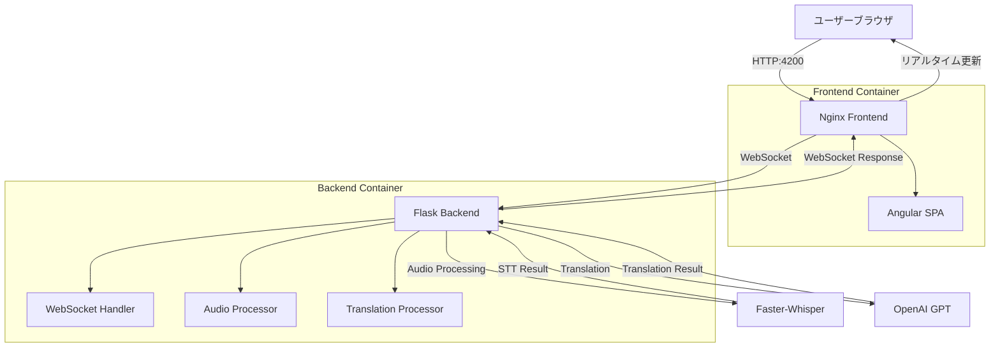

# Frontend/Backend構成およびDocker展開ガイド

## 🎯 プロジェクト概要

**リアルタイム音声翻訳アプリケーション**として、**Angular Frontend**と**Flask Backend**を**Dockerコンテナ**で統合して展開するシステムです。

WebSocketを通じたリアルタイム音声認識（STT）とGPTベースの翻訳機能を提供します。

---

## 🏗️ アーキテクチャ構成

### Frontend (Angular)
- **フレームワーク**: Angular 20 + TypeScript
- **UIライブラリ**: TailwindCSS
- **リアルタイム通信**: WebSocket (Socket.IO Client)
- **展開**: Nginxを通じた静的ファイル配信
- **ポート**: 4200 (開発) / 80 (本番)

### Backend (Flask)
- **フレームワーク**: Python 3.10 + aiohttp
- **音声認識**: Faster-Whisper
- **翻訳**: OpenAI GPT API
- **リアルタイム通信**: WebSocket
- **ポート**: 5000

---

## 🔧 技術スタック詳細

### Frontend技術スタック
```json
{
  "ランタイム": "Node.js 22 Alpine",
  "フレームワーク": "Angular 20.0.0",
  "言語": "TypeScript 5.8.2",
  "スタイリング": "TailwindCSS 3.4.17",
  "リアルタイム通信": "Socket.IO Client 4.8.1",
  "ビルドツール": "Angular CLI 20.0.2",
  "テスト": "Jasmine + Karma",
  "Webサーバー": "Nginx Alpine"
}
```

### Backend技術スタック
```python
{
  "ランタイム": "Python 3.10 Slim",
  "Webフレームワーク": "aiohttp",
  "音声認識": "faster-whisper 1.0.3",
  "翻訳": "OpenAI GPT API",
  "リアルタイム通信": "WebSockets 12.0+",
  "データ処理": "NumPy 1.24.0+",
  "オーディオ処理": "FFmpeg",
  "テスト": "pytest 7.0.0+"
}
```

---

## 📦 Dockerコンテナ構成

### Frontend Dockerfile
```dockerfile
# マルチステージビルド
FROM node:22-alpine AS build
WORKDIR /app
COPY package*.json ./
RUN npm ci
COPY . .
RUN npm run build

# 本番配信
FROM nginx:alpine
COPY --from=build /app/dist/frontend/browser /usr/share/nginx/html
COPY nginx.conf /etc/nginx/nginx.conf
EXPOSE 80
CMD ["nginx", "-g", "daemon off;"]
```

**特徴:**
- マルチステージビルドによる最適化されたイメージサイズ
- Node.js 22 Alpineでビルド
- Nginx Alpineで静的ファイル配信
- 本番ビルドアーティファクトのみ含有

### Backend Dockerfile
```dockerfile
FROM python:3.10-slim as base

# オーディオ処理のためのシステム依存関係インストール
RUN apt-get update && apt-get install -y \
    ffmpeg \
    && rm -rf /var/lib/apt/lists/*

# セキュリティのための非特権ユーザー作成
RUN useradd --create-home --shell /bin/bash app
WORKDIR /app

# 依存関係キャッシュ最適化
COPY requirements-prod.txt requirements.txt
RUN pip install --no-cache-dir --upgrade pip && \
    pip install --cache-dir /app/.cache/pip -r requirements.txt

USER app
COPY --chown=app:app . .
EXPOSE 5000
CMD ["python", "app.py"]
```

**特徴:**
- Python 3.10 Slimベースイメージ
- FFmpegオーディオ処理サポート
- セキュリティのための非特権ユーザー実行
- レイヤーキャッシュ最適化

---

## 🐳 Docker Compose構成

### サービス構成図
```yaml
version: '3.8'

services:
  backend-service:
    build: ./backend
    ports:
      - "5000:5000"
    environment:
      - PYTHONUNBUFFERED=1
      - PYTHONPATH=/app
    networks:
      - app-network
    healthcheck:
      test: ["CMD", "python", "-c", "import requests; requests.get('http://localhost:5000/health', timeout=5)"]
      interval: 30s
      timeout: 10s
      retries: 3

  frontend:
    build: ./frontend
    ports:
      - "4200:80"
    depends_on:
      - backend-service
    environment:
      - BACKEND_URL=http://backend-service:5000
    networks:
      - app-network
    healthcheck:
      test: ["CMD", "curl", "-f", "http://localhost:80"]
      interval: 30s
      timeout: 10s
      retries: 3

networks:
  app-network:
    driver: bridge
```

### ネットワーク構成
- **Internal Network**: `app-network` (Bridgeドライバー)
- **Frontend Port**: 4200 → 80
- **Backend Port**: 5000 → 5000
- **Health Checks**: 30秒間隔でステータス確認

---

## 🔄 データフロー



---

## 🚀 展開および実行

### 1. Docker Compose統合実行
```bash
# 全体スタックビルドおよび実行
docker-compose up --build

# バックグラウンド実行
docker-compose up -d --build

# ログ確認
docker-compose logs -f
```

### 2. 個別サービス実行
```bash
# Backendのみ実行
docker-compose up backend-service

# Frontendのみ実行
docker-compose up frontend
```

### 3. 接続情報
- **Frontend**: http://localhost:4200
- **Backend API**: http://localhost:5000
- **WebSocket**: ws://localhost:5000/ws
- **Health Check**: http://localhost:5000/health

---

## 🔧 開発環境設定

### Frontend開発モード
```bash
cd frontend
npm install
npm start
# http://localhost:4200で実行
```

### Backend開発モード
```bash
cd backend
pip install -r requirements.txt
python app.py
# http://localhost:5000で実行
```

---

## 📊 コンテナリソース使用量

| コンテナ | CPU | メモリ | ディスク | ネットワーク |
|---------|-----|--------|----------|-------------|
| Frontend | ~10MB | ~50MB | ~100MB | HTTP/WebSocket |
| Backend | ~500MB | ~1GB | ~2GB | WebSocket/HTTP |

**注意**: BackendはWhisperモデル読み込みのため、より多くのリソースを使用します。

---

## 🛠️ トラブルシューティング

### 一般的な問題解決

1. **WebSocket接続失敗**
   ```bash
   # Backendコンテナログ確認
   docker-compose logs backend-service
   ```

2. **Frontendビルド失敗**
   ```bash
   # Node.jsキャッシュクリア
   docker-compose build --no-cache frontend
   ```

3. **Backendモデル読み込み失敗**
   ```bash
   # コンテナメモリ確認
   docker stats
   ```

### パフォーマンス最適化
- **Frontend**: Angular本番ビルド使用
- **Backend**: Whisperモデルキャッシュ活用
- **Network**: gzip圧縮有効化

---

## 🔒 セキュリティ考慮事項

### コンテナセキュリティ
- 非特権ユーザーで実行 (Backend)
- 最小権限の原則適用
- 脆弱性スキャン定期実行

### ネットワークセキュリティ
- CORS設定適用
- HTTPS適用推奨 (本番環境)
- WebSocketセキュリティヘッダー設定

---

## 📈 監視およびロギング

### コンテナ状態監視
```bash
# コンテナ状態確認
docker-compose ps

# リソース使用量監視
docker stats

# ログストリーミング
docker-compose logs -f --tail=100
```

### Health Checkエンドポイント
- **Frontend**: `GET http://localhost:4200/`
- **Backend**: `GET http://localhost:5000/health`

---

## 🎯 次のステップ

1. **Kubernetes展開**: Helmチャート作成
2. **CI/CDパイプライン**: GitHub Actions統合
3. **監視**: Prometheus + Grafana設定
4. **ロードバランシング**: 複数インスタンス展開 
