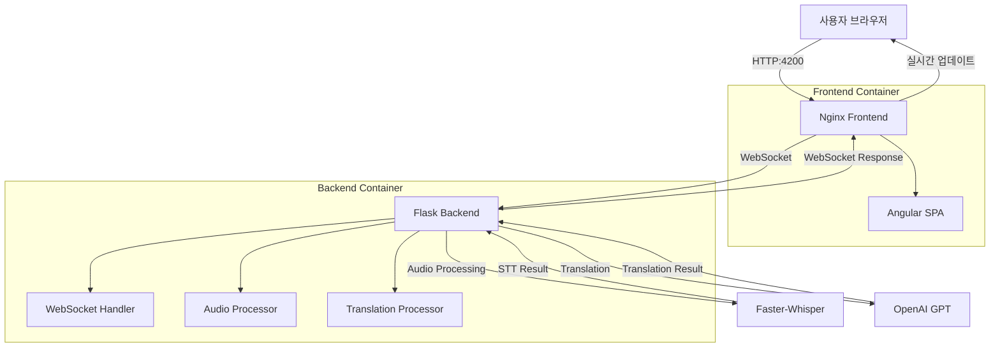

# Frontend/Backend 구성 및 Docker 배포 가이드

## 🎯 프로젝트 개요

**실시간 음성 번역 애플리케이션**으로 **Angular Frontend**와 **Flask Backend**를 **Docker 컨테이너**로 통합하여 배포하는 시스템입니다.

WebSocket을 통한 실시간 음성 인식(STT)과 GPT 기반 번역 기능을 제공합니다.

---

## 🏗️ 아키텍처 구성

### Frontend (Angular)
- **프레임워크**: Angular 20 + TypeScript
- **UI 라이브러리**: TailwindCSS
- **실시간 통신**: WebSocket (Socket.IO Client)
- **배포**: Nginx를 통한 정적 파일 서빙
- **포트**: 4200 (개발) / 80 (프로덕션)

### Backend (Flask)
- **프레임워크**: Python 3.10 + aiohttp
- **음성 인식**: Faster-Whisper
- **번역**: OpenAI GPT API
- **실시간 통신**: WebSocket
- **포트**: 5000

---

## 🔧 기술 스택 상세

### Frontend 기술 스택
```json
{
  "런타임": "Node.js 22 Alpine",
  "프레임워크": "Angular 20.0.0",
  "언어": "TypeScript 5.8.2",
  "스타일링": "TailwindCSS 3.4.17",
  "실시간 통신": "Socket.IO Client 4.8.1",
  "빌드 도구": "Angular CLI 20.0.2",
  "테스트": "Jasmine + Karma",
  "웹서버": "Nginx Alpine"
}
```

### Backend 기술 스택
```python
{
  "런타임": "Python 3.10 Slim",
  "웹 프레임워크": "aiohttp",
  "음성 인식": "faster-whisper 1.0.3",
  "번역": "OpenAI GPT API",
  "실시간 통신": "WebSockets 12.0+",
  "데이터 처리": "NumPy 1.24.0+",
  "오디오 처리": "FFmpeg",
  "테스트": "pytest 7.0.0+"
}
```

---

## 📦 Docker 컨테이너 구성

### Frontend Dockerfile
```dockerfile
# 멀티 스테이지 빌드
FROM node:22-alpine AS build
WORKDIR /app
COPY package*.json ./
RUN npm ci
COPY . .
RUN npm run build

# 프로덕션 서빙
FROM nginx:alpine
COPY --from=build /app/dist/frontend/browser /usr/share/nginx/html
COPY nginx.conf /etc/nginx/nginx.conf
EXPOSE 80
CMD ["nginx", "-g", "daemon off;"]
```

**특징:**
- 멀티 스테이지 빌드로 최적화된 이미지 크기
- Node.js 22 Alpine으로 빌드
- Nginx Alpine으로 정적 파일 서빙
- 프로덕션 빌드 아티팩트만 포함

### Backend Dockerfile
```dockerfile
FROM python:3.10-slim as base

# 오디오 처리를 위한 시스템 의존성 설치
RUN apt-get update && apt-get install -y \
    ffmpeg \
    && rm -rf /var/lib/apt/lists/*

# 보안을 위한 비특권 사용자 생성
RUN useradd --create-home --shell /bin/bash app
WORKDIR /app

# 의존성 캐싱 최적화
COPY requirements-prod.txt requirements.txt
RUN pip install --no-cache-dir --upgrade pip && \
    pip install --cache-dir /app/.cache/pip -r requirements.txt

USER app
COPY --chown=app:app . .
EXPOSE 5000
CMD ["python", "app.py"]
```

**특징:**
- Python 3.10 Slim 베이스 이미지
- FFmpeg 오디오 처리 지원
- 보안을 위한 비특권 사용자 실행
- 레이어 캐싱 최적화

---

## 🐳 Docker Compose 구성

### 서비스 구성도
```yaml
version: '3.8'

services:
  backend-service:
    build: ./backend
    ports:
      - "5000:5000"
    environment:
      - PYTHONUNBUFFERED=1
      - PYTHONPATH=/app
    networks:
      - app-network
    healthcheck:
      test: ["CMD", "python", "-c", "import requests; requests.get('http://localhost:5000/health', timeout=5)"]
      interval: 30s
      timeout: 10s
      retries: 3

  frontend:
    build: ./frontend
    ports:
      - "4200:80"
    depends_on:
      - backend-service
    environment:
      - BACKEND_URL=http://backend-service:5000
    networks:
      - app-network
    healthcheck:
      test: ["CMD", "curl", "-f", "http://localhost:80"]
      interval: 30s
      timeout: 10s
      retries: 3

networks:
  app-network:
    driver: bridge
```

### 네트워크 구성
- **Internal Network**: `app-network` (Bridge 드라이버)
- **Frontend Port**: 4200 → 80
- **Backend Port**: 5000 → 5000
- **Health Checks**: 30초 간격 상태 확인

---

## 🔄 데이터 플로우



---

## 🚀 배포 및 실행

### 1. Docker Compose 통합 실행
```bash
# 전체 스택 빌드 및 실행
docker-compose up --build

# 백그라운드 실행
docker-compose up -d --build

# 로그 확인
docker-compose logs -f
```

### 2. 개별 서비스 실행
```bash
# Backend만 실행
docker-compose up backend-service

# Frontend만 실행
docker-compose up frontend
```

### 3. 접속 정보
- **Frontend**: http://localhost:4200
- **Backend API**: http://localhost:5000
- **WebSocket**: ws://localhost:5000/ws
- **Health Check**: http://localhost:5000/health

---

## 🔧 개발 환경 설정

### Frontend 개발 모드
```bash
cd frontend
npm install
npm start
# http://localhost:4200에서 실행
```

### Backend 개발 모드
```bash
cd backend
pip install -r requirements.txt
python app.py
# http://localhost:5000에서 실행
```

---

## 📊 컨테이너 리소스 사용량

| 컨테이너 | CPU | 메모리 | 디스크 | 네트워크 |
|---------|-----|--------|--------|----------|
| Frontend | ~10MB | ~50MB | ~100MB | HTTP/WebSocket |
| Backend | ~500MB | ~1GB | ~2GB | WebSocket/HTTP |

**참고**: Backend는 Whisper 모델 로딩으로 인해 더 많은 리소스를 사용합니다.

---

## 🛠️ 트러블슈팅

### 일반적인 문제 해결

1. **WebSocket 연결 실패**
   ```bash
   # Backend 컨테이너 로그 확인
   docker-compose logs backend-service
   ```

2. **Frontend 빌드 실패**
   ```bash
   # Node.js 캐시 클리어
   docker-compose build --no-cache frontend
   ```

3. **Backend 모델 로딩 실패**
   ```bash
   # 컨테이너 메모리 확인
   docker stats
   ```

### 성능 최적화
- **Frontend**: Angular 프로덕션 빌드 사용
- **Backend**: Whisper 모델 캐싱 활용
- **Network**: gzip 압축 활성화

---

## 🔒 보안 고려사항

### 컨테이너 보안
- 비특권 사용자로 실행 (Backend)
- 최소 권한 원칙 적용
- 취약점 스캔 정기 실행

### 네트워크 보안
- CORS 설정 적용
- HTTPS 적용 권장 (프로덕션)
- WebSocket 보안 헤더 설정

---

## 📈 모니터링 및 로깅

### 컨테이너 상태 모니터링
```bash
# 컨테이너 상태 확인
docker-compose ps

# 리소스 사용량 모니터링
docker stats

# 로그 스트리밍
docker-compose logs -f --tail=100
```

### Health Check 엔드포인트
- **Frontend**: `GET http://localhost:4200/`
- **Backend**: `GET http://localhost:5000/health`

---

## 🎯 다음 단계

1. **Kubernetes 배포**: Helm 차트 작성
2. **CI/CD 파이프라인**: GitHub Actions 통합
3. **모니터링**: Prometheus + Grafana 설정
4. **로드 밸런싱**: 다중 인스턴스 배포 
