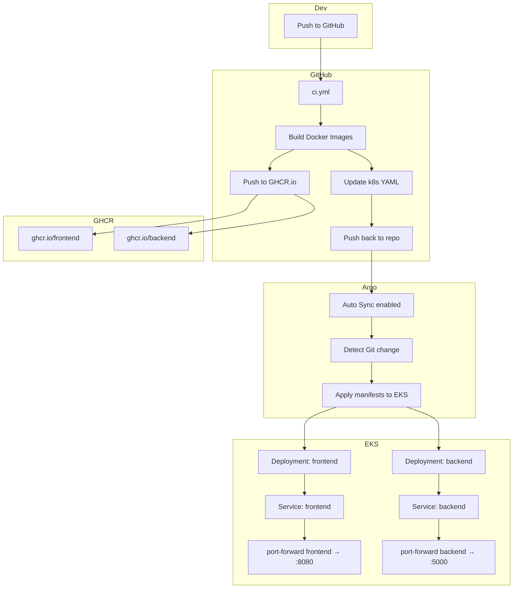

# Fullstack Kubernetes App with GitOps CI/CD

## 🧭 프로젝트 개요

**Angular(Frontend)** 와 **Flask(Backend)** 로 구성된 웹 애플리케이션을 **Docker 컨테이너로 패키징**하고, **Kubernetes 클러스터 (AWS EKS)** 에 **GitOps 방식으로 자동 배포**하는 데모

DevOps 기술 스택: **GitHub Actions**, **GHCR**, **Argo CD**, **Kustomize**, **kubectl port-forward** 등

---

## 🔧 기술 스택 요약

* **Frontend**: Angular 20, TypeScript, Nginx
* **Backend**: Python 3.10, Flask 3, flask-cors
* **CI/CD**: GitHub Actions, Docker, GHCR, Argo CD
* **Kubernetes**: EKS (namespace: `jonny`) + Kustomize
* **로컬 실행**: Docker Compose / 포트포워딩

---

## 📁 프로젝트 구조

```
.
├── backend/                  # Flask API 서버
│   ├── app.py               # /api/hello 엔드포인트
│   ├── test_app.py          # pytest 테스트
│   ├── requirements.txt
│   ├── pyproject.toml       # black, isort 등 코드 스타일 설정
│   └── Dockerfile
│
├── frontend/                # Angular SPA 프론트
│   ├── src/app/app.ts       # API 호출, 메시지 렌더링
│   ├── angular.json         # 빌드 설정
│   ├── nginx.conf           # 정적 파일 Nginx 설정
│   └── Dockerfile
│
├── k8s/                     # Kubernetes 리소스
│   ├── backend-deployment.yaml
│   ├── frontend-deployment.yaml
│   ├── argocd-app.yaml      # Argo CD Application 리소스
│   ├── kustomization.yaml   # Kustomize
│   └── namespace.yaml
│
├── .github/workflows/ci.yml # GitHub Actions
└── docker-compose.yml       # 로컬 통합 실행
```

---

## 🔁 CI/CD 파이프라인 (자동화 흐름)

### GitHub Actions 기반:

1. `main` 브랜치로 푸시
2. GitHub Actions:

   * Frontend/Backend 테스트, 린트, 타입 체크
   * Docker 이미지 빌드
   * GHCR 레지스트리에 이미지 푸시
   * `k8s/` 내 YAML 파일의 이미지 태그 업데이트 (sed)
   * 변경사항 Git에 푸시
3. Argo CD가 Git 변경 감지 → 자동 배포 (Auto Sync)

---

## ☁️ Kubernetes 배포 구성

* 네임스페이스: `jonny`
* Deployment:

  * `frontend-deployment`: Angular 빌드 → Nginx 서빙
  * `backend-deployment`: Flask API 서버
* Service:

  * `frontend-service`: ClusterIP, 포트 80
  * `backend-service`: ClusterIP, 포트 5000
* 헬스체크: liveness/readiness probe 포함
* 포트포워딩:

  ```bash
  kubectl port-forward svc/frontend-service 8080:80 -n jonny
  ```

---

## 📊 대략적인 CI/CD + 클러스터 아키텍처



---

## 🚀 로컬 개발 방법

### Docker Compose 통합 실행

```bash
docker-compose up --build
```

* Frontend: [http://localhost:4200](http://localhost:4200)
* Backend: 내부에서만 호출됨 (프록시를 통해 연결됨)

### 개별 서비스 개발

* Frontend: `npm start` 또는 `ng serve`
* Backend: `python app.py` (venv, conda, Flask dev server)

---

## 📈 품질 관리 및 테스트

### Frontend:

* ESLint, TypeScript, @angular-eslint
* Karma + Jasmine 테스트 커버리지

### Backend:

* pytest + pytest-cov
* black, flake8, isort, mypy
