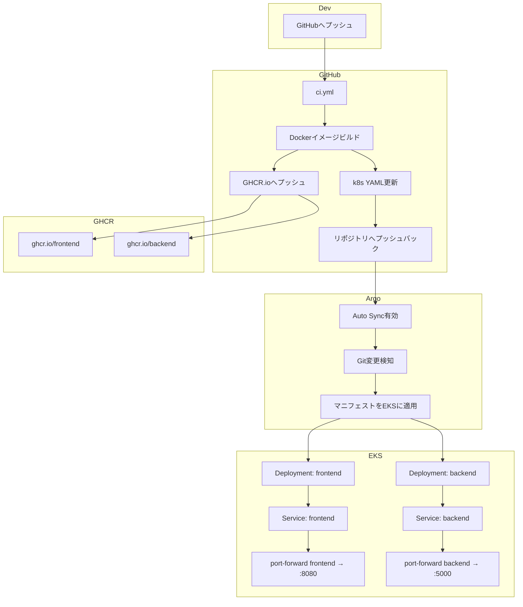

# GitOps CI/CDを活用したフルスタックKubernetesアプリケーション

## 🧭 プロジェクト概要

**Angular（フロントエンド）**と**Flask（バックエンド）**で構成されたWebアプリケーションを**Dockerコンテナにパッケージング**し、**Kubernetesクラスター（AWS EKS）**に**GitOps方式で自動デプロイ**するデモ

DevOps技術スタック：**GitHub Actions**、**GHCR**、**Argo CD**、**Kustomize**、**kubectl port-forward**など

---

## 🔧 技術スタック概要

* **フロントエンド**：Angular 20、TypeScript、Nginx
* **バックエンド**：Python 3.10、Flask 3、flask-cors
* **CI/CD**：GitHub Actions、Docker、GHCR、Argo CD
* **Kubernetes**：EKS（namespace：`jonny`）+ Kustomize
* **ローカル実行**：Docker Compose / ポートフォワーディング

---

## 📁 プロジェクト構造

```
.
├── backend/                  # Flask APIサーバー
│   ├── app.py               # /api/helloエンドポイント
│   ├── test_app.py          # pytestテスト
│   ├── requirements.txt
│   ├── pyproject.toml       # black、isortなどコードスタイル設定
│   └── Dockerfile
│
├── frontend/                # Angular SPAフロント
│   ├── src/app/app.ts       # API呼び出し、メッセージレンダリング
│   ├── angular.json         # ビルド設定
│   ├── nginx.conf           # 静的ファイルNginx設定
│   └── Dockerfile
│
├── k8s/                     # Kubernetesリソース
│   ├── backend-deployment.yaml
│   ├── frontend-deployment.yaml
│   ├── argocd-app.yaml      # Argo CD Applicationリソース
│   ├── kustomization.yaml   # Kustomize
│   └── namespace.yaml
│
├── .github/workflows/ci.yml # GitHub Actions
└── docker-compose.yml       # ローカル統合実行
```

---

## 🔁 CI/CDパイプライン（自動化フロー）

### GitHub Actions基盤：

1. `main`ブランチへのプッシュ
2. GitHub Actions：

   * フロントエンド/バックエンドのテスト、リント、型チェック
   * Dockerイメージビルド
   * GHCRレジストリへのイメージプッシュ
   * `k8s/`内YAMLファイルのイメージタグ更新（sed）
   * 変更をGitにプッシュ
3. Argo CDがGitの変更を検知→自動デプロイ（Auto Sync）

---

## ☁️ Kubernetesデプロイ構成

* ネームスペース：`jonny`
* Deployment：

  * `frontend-deployment`：Angularビルド→Nginxサービング
  * `backend-deployment`：Flask APIサーバー
* Service：

  * `frontend-service`：ClusterIP、ポート80
  * `backend-service`：ClusterIP、ポート5000
* ヘルスチェック：liveness/readiness probeを含む
* ポートフォワーディング：

  ```bash
  kubectl port-forward svc/frontend-service 8080:80 -n jonny
  ```

---

## 📊 CI/CD + クラスターアーキテクチャ概要



---

## 🚀 ローカル開発方法

### Docker Compose統合実行

```bash
docker-compose up --build
```

* フロントエンド：[http://localhost:4200](http://localhost:4200)
* バックエンド：内部からのみ呼び出し（プロキシ経由で接続）

### 個別サービス開発

* フロントエンド：`npm start`または`ng serve`
* バックエンド：`python app.py`（venv、conda、Flask開発サーバー）

---

## 📈 品質管理とテスト

### フロントエンド：

* ESLint、TypeScript、@angular-eslint
* Karma + Jasmineテストカバレッジ

### バックエンド：

* pytest + pytest-cov
* black、flake8、isort、mypy
